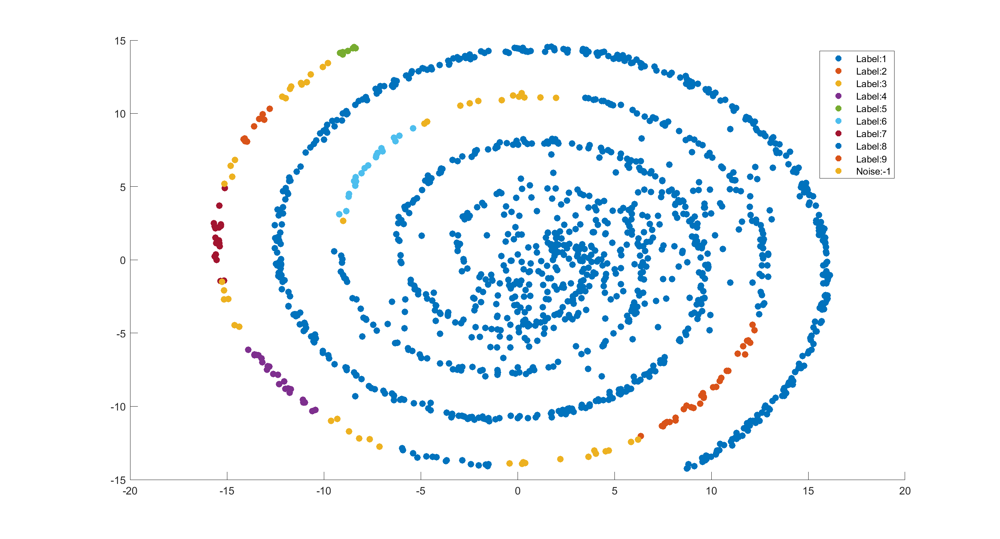
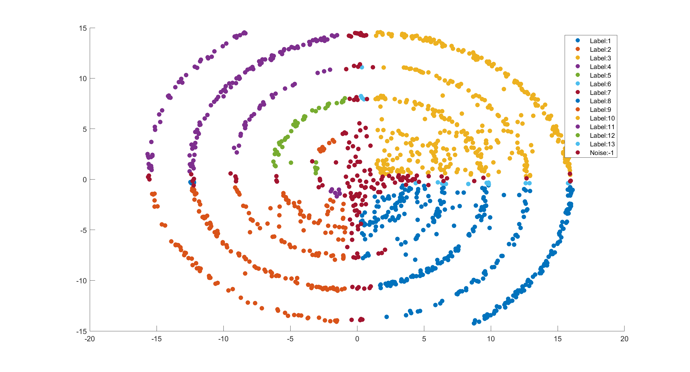

# Home Assignment 1 - Performance Evaluation

Allar Viinamäe - 163578IAPM

## Representative based clustering using k-means algorithm

| Parameter       | Value              |
|-----------------|--------------------|
| clusters        | 4                  |
| iterations      | 10                 |
| metric function | Euclidean distance |

Table: Hyper parameters for k-means

\

Result with own implementation using Euclidean distance. Here green marks represent final position of centroids. Execution time is 0.514800 seconds.

\

Result with Matlab's implementation. Matlab's implementation produces identical result. Execution time is 0.019262 seconds.

\

Result with own implementation using Cosine distance. Euclidean distance seems to best fit the k-means in general, but here Cosine distance is used for comparison.

\pagebreak

## Density based clustering using DBSCAN

| Parameter       | Value              |
|-----------------|--------------------|
| epsilon         | 4                  |
| minPts          | 7                  |
| metric function | Euclidean distance |

Table: Hyper parameters for DBSCAN on regular dataset

\

Result with own implementation using Euclidean distance. Points labeled as -1 represent noise points. Here a rather faulty extra small yellow colored cluster is labeled.

| Parameter       | Value              |
|-----------------|--------------------|
| epsilon         | 1.5                |
| minPts          | 8                  |
| metric function | Euclidean distance |

Table: Hyper parameters for DBSCAN on spiral dataset

\

A dataset in spiral form is tested. Very hard to distinguish spiral cluster from the second gaussian distributed cluster. Note that decreasing minPts produces greater amount of different clusters. Execution time is 72.369003 seconds.

| Parameter       | Value              |
|-----------------|--------------------|
| epsilon         | 0.2                |
| minPts          | 4                  |
| metric function | Canberra distance |

Table: Hyper parameters for DBSCAN on spiral dataset using Canberra distance

\

For comparison spiral dataset is tested with Canberra distance function. Clear sector clusters have been produced, but clearly not the point of DBSCAN clustering algorithm. Execution time is 23.882735 seconds.

### Conclusion

For k-means algorithm, own implementation and Matlab's implementation give identical results, but Matlab's code is more efficient regarding execution time. Compared to DBSCAN, k-means runs much faster and doesn't require knowledge about cluster count prior to executing the algorithm. DBSCAN runs a lot longer, but can produce clusters in arbitrary shapes and also labels points not very close to defined clusters as noise, which can be useful to better distinguish clusters.