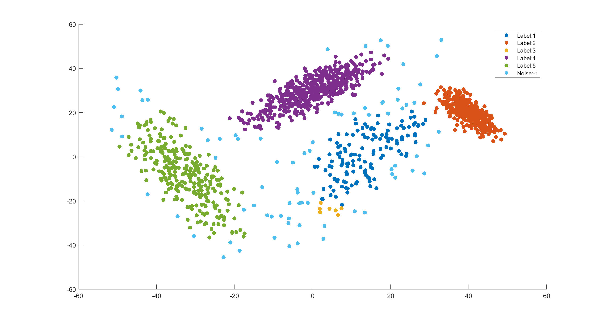

# Home assignment 1

## Performance evaluation

### Representative based clustering using k-means algorithm

| Parameter       | Value              |
|-----------------|--------------------|
| clusters        | 4                  |
| iterations      | 10                 |
| metric function | Euclidean distance |

Table: Hyperparameters for k-means

\

Result with own implementation using Euclidean distance. Here green marks represent final position of centroids.

\

Result with Matlab's implementation. Matlab's implementation produces identical result.

\

Result with own implementation using Cosine distance. Euclidean distance seems to best fit the k-means in general, but here Cosine distance is used for comparison.

\pagebreak

### Density based clustering using DBSCAN

| Parameter       | Value              |
|-----------------|--------------------|
| epsilon         | 4                  |
| minPts          | 7                  |
| metric function | Euclidean distance |

Table: Hyperparameters for DBSCAN

\

Result with own implementation using Euclidean distance.